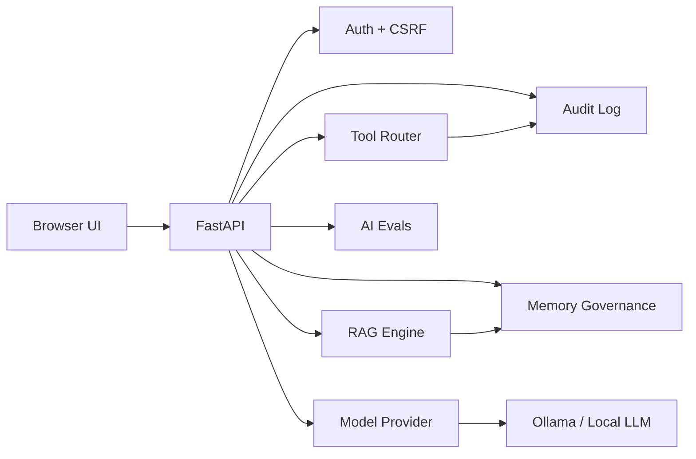
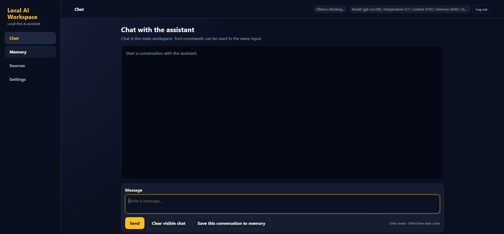
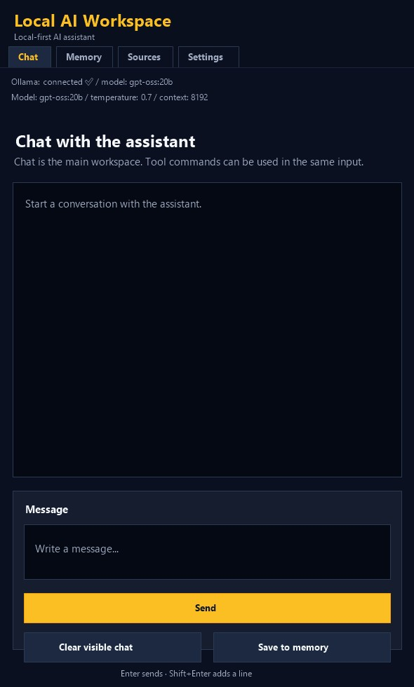

# Local AI Workspace


Local AI Workspace is a local-first AI assistant project demonstrating practical AI engineering with FastAPI, local LLM integration, memory, retrieval, testing, security and maintainable architecture.

It is designed as a portfolio-stage project. The focus is not only on model interaction, but also on testability, memory governance, tool permissions, prompt-injection awareness, authentication, observability and release hygiene.

## What this project demonstrates

- Building a local AI assistant with FastAPI and a browser-based UI.
- Designing memory and RAG workflows with explicit truth boundaries.
- Separating user-facing features from advanced developer tools.
- Implementing authentication, CSRF protection, audit logging and backup workflows.
- Adding AI evals, prompt-injection checks, tool risk policies and release readiness checks.
- Using deterministic safety routing for high-risk prompts and project-identity smoke tests.
- Presenting operational health through a sanitized dashboard that hides local paths from normal use.
- Maintaining a portfolio-friendly open-source project surface with README, QUICKSTART, SECURITY, CONTRIBUTING, CI, issue templates and changelog.

## Engineering skills demonstrated

Local AI Workspace demonstrates practical AI engineering rather than only prompt experimentation:

- local AI application architecture with FastAPI;
- authentication, CSRF protection, audit logging and guarded file tools;
- RAG, semantic memory, web-search truth boundaries and AI eval entrypoints;
- response planning and answer grounding for intent routing, source selection, context gating and output validation before tool use;
- deterministic safety routing for secret-file requests, destructive actions, missing-source claims and portfolio smoke tests;
- test-driven hardening with pytest, coverage reports and release readiness checks;
- portfolio-quality documentation and a maintainable GitHub project surface.

## Highlights

- Local-first AI workspace using Ollama through a model provider layer.
- Chat, memory, sources and settings as the user-facing UI.
- Finnish/English UI language switch.
- Memory governance: list memories, export memory and guarded deletion API.
- RAG and source quality checks for safer retrieval-assisted answers.
- Prompt-injection detection and tool risk classification.
- Response Planning Layer for intent routing, context gating and output validation before tool use.
- Answer Grounding / Knowledge Source Selection Layer to choose between chat context, memory, project state, RAG, web search and model knowledge.
- Deterministic safety routing for secret-file requests, destructive actions, missing-source claims and portfolio smoke tests.
- Audit log and debug trace for safety and observability.
- Project Health Dashboard with sanitized server, version, model, RAG, web search, audit, test, release, storage and privacy status.
- Authentication with local users, CSRF protection and session cookies.
- Static and live AI eval entrypoints.
- Backup/restore workflow for local data.
- GitHub Actions CI with quality checks, dependency audit, pytest matrix and coverage reporting.

## Architecture



More detail: [docs/architecture.md](docs/architecture.md)

## Screenshots

The interface is browser-based and can be accessed from both desktop and mobile devices over a trusted local network or secure remote connection.

The same Local AI Workspace runs as one local AI service and can be opened from multiple devices.

Screenshots include:

- Desktop browser view on the local workstation
- Focused desktop app view
- Mobile browser access over a trusted network
- Mobile app-style preview

**Focused desktop app view**



**Mobile app-style preview**



More screenshot notes: [docs/screenshots/README.md](docs/screenshots/README.md).

## Quickstart

```powershell
git clone https://github.com/denzo69/local-ai-workspace.git
cd local-ai-workspace
.\.venv\Scripts\python.exe -m pip install -r requirements.txt
.\app\create_sade_user.bat
.\app\restart_local_ai_workspace.bat
```

Open:

```text
http://127.0.0.1:8080/ui
```

More detail: [QUICKSTART.md](QUICKSTART.md)

## Tests

Run the full test suite and generate coverage/JUnit reports:

```powershell
.\.venv\Scripts\python.exe -m pytest
```

The pytest configuration writes:

- `reports/coverage.xml`
- `reports/junit.xml`
- `reports/htmlcov/`

Current local status:

- 419 tests passing locally.
- 93% total test coverage with branch coverage enabled.
- GitHub Actions: configured with quality checks, dependency audit, Python 3.10-3.12 matrix and coverage artifacts.
- Large deterministic interaction baseline: 10,000 question chains / 40,000 routing checks / 0 failures.
- Bilingual behavior eval: 21 cases / 0 failures.
- Focus behavior eval: 1,000 cases / 4,000 checks / 0 failures.
- Targeted hardening covers auth/session safety, project health reporting, upload validation, response planning, answer grounding, manual AI behavior checks, persona/context handling, codebase mapping, RAG, web search, automatic factual-search routing, model provider fallback, tool routing, API routes, live eval entrypoints and cleanup paths.

Release readiness:

```powershell
.\.venv\Scripts\python.exe scripts\release_readiness.py
```

## Suggested demo flow

Try these in order:

1. Open the UI and send a chat message.
2. Add a memory in Memory.
3. Upload a document in Sources.
4. Search from sources in advanced tools.
5. Run static evals.
6. Create a backup archive.
7. Check audit status.
8. Open the Project Health Dashboard.

## Web search providers

Web search is provider-based. By default, the app uses `SADE_WEB_SEARCH_PROVIDER=auto`.

Provider selection:

- Google Programmable Search if `GOOGLE_SEARCH_API_KEY` and `GOOGLE_SEARCH_ENGINE_ID` are configured.
- Brave Search if `BRAVE_SEARCH_API_KEY` is configured.
- DuckDuckGo Lite as a no-key best-effort fallback.

Supported values:

```text
SADE_WEB_SEARCH_PROVIDER=auto
SADE_WEB_SEARCH_PROVIDER=duckduckgo
SADE_WEB_SEARCH_PROVIDER=brave
SADE_WEB_SEARCH_PROVIDER=google
```

Bing is documented as a future Azure AI Foundry / Grounding with Bing integration rather than using the retired legacy Bing Search APIs.

## Key routes

| Route | Purpose |
|---|---|
| `/ui` | Browser UI |
| `/chat` | Chat endpoint |
| `/auth/status` | Authentication status |
| `/memory/entries` | List memory entries |
| `/memory/export` | Export memory |
| `/backup/archive` | Create zip backup |
| `/rag/search` | Source-aware retrieval |
| `/rag/quality` | RAG quality gate |
| `/tools/policies` | Tool risk policies |
| `/evals/static` | Static AI evals |
| `/evals/live` | Optional live model evals |
| `/debug/trace` | Developer trace |

## Safety model

Safety principles:

- Web results are sources, not automatic truth.
- Personal memory is not committed to Git.
- High-risk tool actions are audited.
- Developer tools are behind advanced settings.
- Secrets, sessions, vector DBs, uploads, and backups are excluded from the public repo.

See [SECURITY.md](SECURITY.md).

## Known limitations

- This project is intended for local or trusted-network use, not direct public internet exposure.
- Web search returns sources and cautious summaries, but source claims are not automatically guaranteed as true.
- Local model quality depends on the installed Ollama model.
- Some internal names originate from the earlier Finnish prototype stage.
- Production deployment would require additional hardening, monitoring, user management and operational review.

## License

This project is licensed under the MIT License. See [LICENSE](LICENSE).

## Documentation

- [Architecture](docs/architecture.md)
- [Code Rewrite Protocol](docs/code_rewrite_protocol.md)
- [Authentication Policy](docs/authentication_policy.md)
- [Tool Risk Policy](docs/tool_risk_policy.md)
- [AI Evaluation Policy](docs/ai_evaluation_policy.md)
- [Memory Governance Policy](docs/memory_governance_policy.md)
